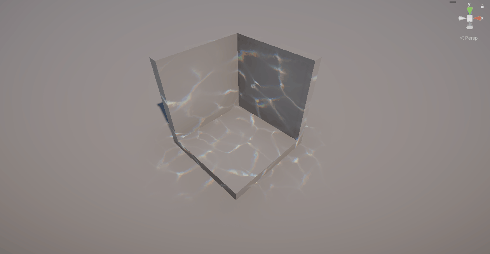
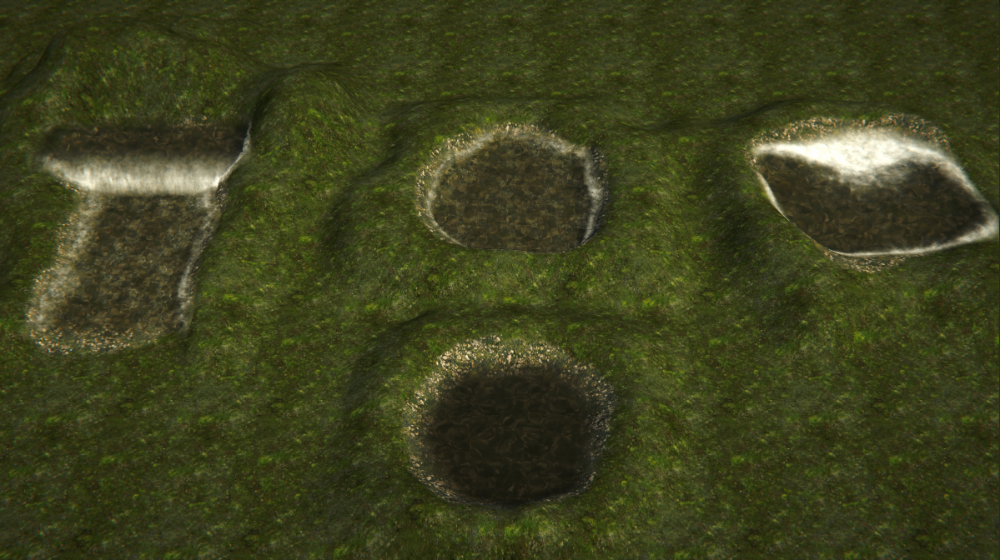

# 练习使用ShaderGraph编写着色器案例

*Info:  
对于贴花通常只能在朝向面进行显示，其它的侧面就会出现拉伸的问题。  
面的法线向量计算：  
偏导数函数可以用来在片元着色器中计算当前（三角形）的法线向量。当前片元的世界坐标系的水平偏导数和垂直偏导数是两个三角形表面上的两个向量，他们的叉乘结果是一个垂直于表面的向量，该向量的归一化结果就是面的法线向量。  
需要特别注意的是两个向量的叉乘顺序。*

 
  

  

  

  

